# QuestHub — Domain Architecture

---

## 1. Conceptual Domain Model

### 1.1 Entity List

| # | Entity | Description |
|---|--------|-------------|
| 1 | **User** | Người dùng platform; role USER / CREATOR / ADMIN |
| 2 | **Follow** | Mối quan hệ theo dõi giữa hai User; User.followerCount/followingCount là denormalized counter, Follow table thuộc Social service |
| 3 | **SkillDomain** | Lĩnh vực kỹ năng lớn (Programming, Language, Fitness...) — đỉnh của hierarchy nội dung |
| 4 | **LearningPath** | Lộ trình học đầy đủ hướng đến một mục tiêu, gồm nhiều Quest có thứ tự; thuộc đúng một SkillDomain |
| 5 | **Quest** | Template học tập do Creator tạo; cấu trúc chapter/task bất biến sau khi publish, metadata và CompletionRule có thể cập nhật (chỉ ảnh hưởng fork mới) |
| 6 | **Chapter** | Nhóm Task trong Quest; chia Quest thành phần nhỏ có thứ tự |
| 7 | **Task** | Đơn vị học nhỏ nhất; có type riêng (LEARN / QUIZ / PRACTICE / SUBMISSION / REFLECTION) |
| 8 | **Resource** | Tài liệu đính kèm Task loại LEARN (video, article, book, course, podcast, file, link) |
| 9 | **PersonalQuest** | Bản fork của Quest về tay Learner; độc lập hoàn toàn với Quest gốc; kế thừa learningPathId khi fork |
| 10 | **PersonalChapter** | Chapter tương ứng trong PersonalQuest |
| 11 | **PersonalTask** | Task tương ứng trong PersonalChapter; nơi ghi nhận trạng thái và bằng chứng hoàn thành |
| 12 | **TaskCompletion** | Bản ghi khi Learner hoàn thành một PersonalTask (source of truth cho World và Achievement) |
| 13 | **QuizAttempt** | Kết quả một lần làm quiz của Task loại QUIZ (score, max_score, passed) |
| 14 | **SubmissionGrade** | Kết quả AI chấm bài Task loại SUBMISSION/PRACTICE (PASS / FAIL / NEEDS_REVISION + score + feedback) |
| 15 | **Review** | Đánh giá 1–5 sao + comment của Learner cho Quest đã fork |
| 16 | **Favorite** | Quest được Learner lưu lại để xem sau; không cần fork |
| 17 | **World** | Thế giới cá nhân của User; phản ánh tiến bộ thật dựa trên TaskCompletion |
| 18 | **District** | Khu vực trong World; đại diện cho một SkillDomain |
| 19 | **Building** | Công trình visualize trong District — thuần trang trí, không ảnh hưởng logic |
| 20 | **Achievement** | Thành tựu intrinsic gắn mốc thật (quest đầu tiên, X tasks, Y tasks trong 1 domain...) |
| 21 | **UserAchievement** | Bản ghi thành tựu đã mở khóa của User |
| 22 | **Activity** | Sự kiện do User tạo ra (quest_completed, quest_forked, achievement_unlocked...); nguồn của Feed — Social service (Go) |
| 23 | **Discussion** | Chủ đề thảo luận gắn với Quest (hỏi đáp, chia sẻ) — Social service (Go) |
| 24 | **Comment** | Bình luận trên Quest hoặc trong Discussion; reply lồng nhau tối đa 2 cấp — Social service (Go) |
| 25 | **CoachSession** | Phiên trò chuyện giữa User và AI Coach — AI service (Python) |
| 26 | **CoachMessage** | Tin nhắn trong CoachSession (User message hoặc AI streaming response) — AI service (Python) |
| 27 | **Notification** | Thông báo gửi đến User tại các sự kiện lifecycle (in-app + push + email) — Notification service (Go) |
| 28 | **FeatureFlag** | Cờ bật / tắt tính năng quản lý bởi Admin; có hiệu lực ngay, không cần redeploy |
| 29 | **LeaderboardStat** | Read model tổng hợp (userId, questCount, taskCount); không có bảng riêng, computed từ PersonalQuest + TaskCompletion |

### 1.2 Domain Model Diagram

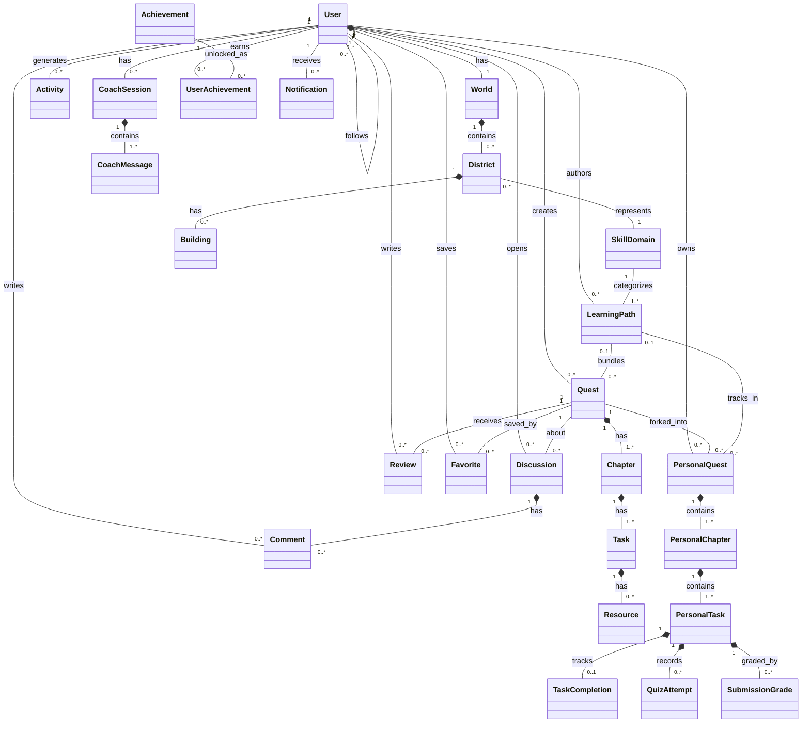

---

## 2. Business Flow

### 2.1 Main Flow

**Actors**: Creator, Learner | **Precondition**: SkillDomain và LearningPath đã tồn tại | **Result**: Learner hoàn thành Quest, World cập nhật, Review ghi nhận

```mermaid
flowchart TD
    A[Creator tạo Quest gắn vào LearningPath thuộc SkillDomain] --> B[Thêm Chapter và LEARN Task, gắn Resource]
    B --> C[Set CompletionRule = ALL_TASKS]
    C --> D[Publish: DRAFT → PUBLIC]
    D --> E[Quest xuất hiện trong Marketplace theo SkillDomain]

    E --> F[Learner browse Marketplace theo SkillDomain]
    F --> G[Xem Quest detail: chapter, task, review, avg rating]
    G --> H[Fork Quest]
    H --> I[PersonalQuest: ACTIVE, CompletionRule + learningPathId snapshot]
    I --> J[Chọn LEARN task → đọc Resource → tick hoàn thành]
    J --> K[TaskCompletion tạo, progress tính lại]
    K --> L{Còn task chưa xong?}
    L -- Có --> J
    L -- Không --> M[CompletionRule ALL_TASKS thỏa]
    M --> N[PersonalQuest = COMPLETED, completedAt saved]
    N --> O[District.completionCount tăng trong World]
    O --> P{Building unlock threshold reached?}
    P -- Có --> Q[Unlock Building in District]
    P -- Không --> R[Check Achievement criteria]
    Q --> R
    R --> S{Achievement criteria met?}
    S -- Có --> T[UserAchievement tạo + Notification gửi]
    S -- Không --> U[Activity: quest_completed sinh ra]
    T --> U
    U --> V[Notify followers via Feed]
    V --> W[Learner viết Review: score + comment]
    W --> X[Quest avg_rating cập nhật]
```

1. **Publish Quest** — Creator tạo Quest gắn vào LearningPath (Quest có domain qua chain Quest → LearningPath → SkillDomain), thêm chapters/tasks/resources, set CompletionRule = ALL_TASKS, publish DRAFT → PUBLIC
2. **Browse & Fork** — Learner browse theo SkillDomain → xem detail → fork; system tạo PersonalQuest + PersonalChapters + PersonalTasks, snapshot CompletionRule và learningPathId; unique constraint: 1 fork per user per quest
3. **Complete Tasks** — Learner đọc Resource trên LEARN task → tick hoàn thành; mỗi lần tạo TaskCompletion, progress tính lại
4. **Evaluate Rule** — Khi tất cả task xong, CompletionRule ALL_TASKS thỏa → PersonalQuest = COMPLETED, completedAt saved
5. **Update World** — District.completionCount tăng cho SkillDomain tương ứng; kiểm tra Building unlock threshold
6. **Achievement + Activity** — Evaluate Achievement criteria; nếu đạt → UserAchievement + Notification; tạo Activity (quest_completed) xuất hiện trong Feed followers
7. **Review** — Learner viết Review (1–5 sao + comment tùy chọn); Quest avg_rating và rating_count cập nhật

---

### 2.2 Alternative Flows

#### A1 — Task Type Variants (QUIZ / SUBMISSION / REFLECTION)

**Khi nào**: Quest có task loại QUIZ, SUBMISSION/PRACTICE, hoặc REFLECTION — đều thành công ngay lần đầu

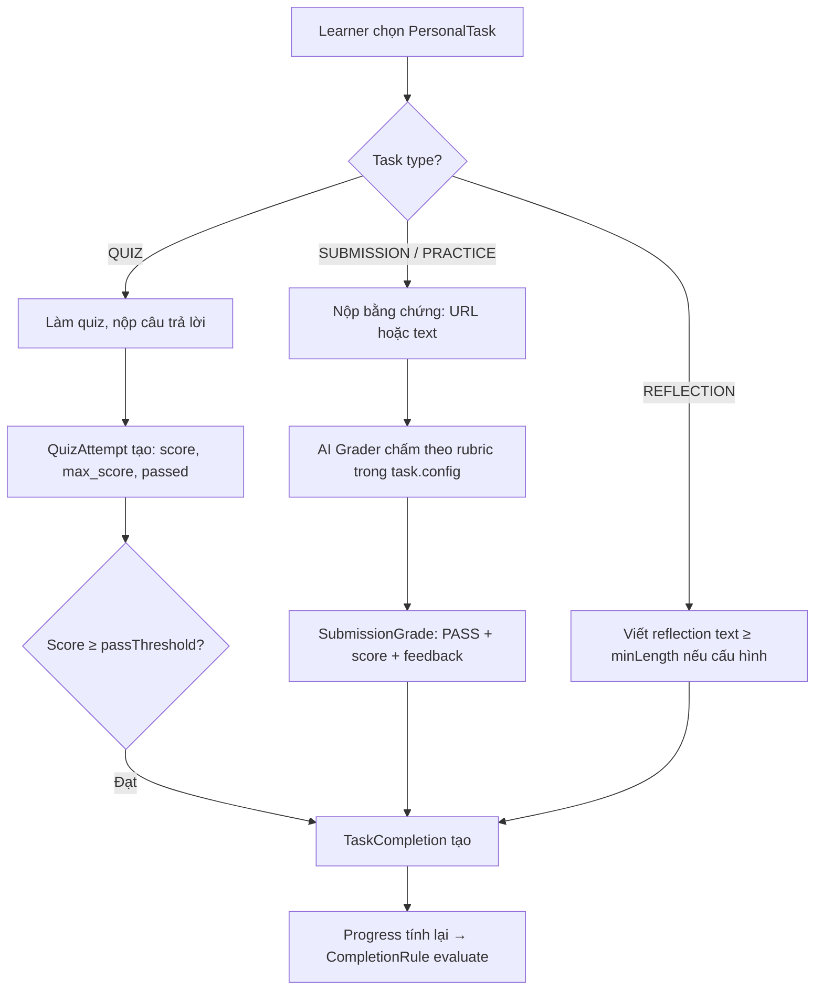

- **QUIZ**: không có rate-limit; đạt passThreshold → TaskCompletion tự động; QuizAttempt history lưu hết
- **SUBMISSION / PRACTICE**: chỉ áp dụng khi task.config có rubric; rate-limit 20 req/day toàn user; PASS → TaskCompletion tự tạo + CompletionRule evaluate
- **REFLECTION**: không có AI grading; chỉ cần text ≥ minLength nếu được cấu hình

---

#### A2 — Quest Discovery Variants

**Khi nào**: Learner tìm Quest qua con đường khác browse-by-domain mặc định

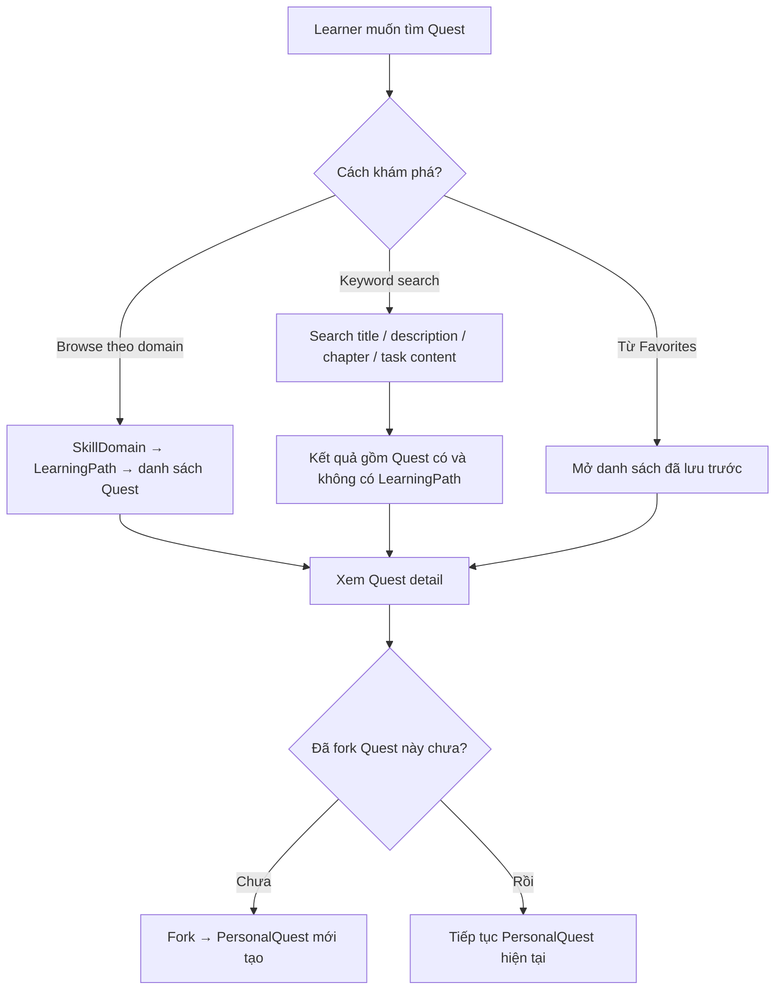

- Browse theo domain chỉ hoạt động với Quest có LearningPath; Quest standalone không xuất hiện trong domain browse
- Keyword search trả về cả Quest standalone; filter theo domain chỉ khả dụng với Quest có LearningPath
- Favorite là shortcut — không tạo PersonalQuest, chỉ lưu pointer đến Quest

---

#### A3 — Creator Quản Lý Quest Sau Publish

**Khi nào**: Creator cần chỉnh sửa hoặc xem kết quả Quest đang PUBLIC

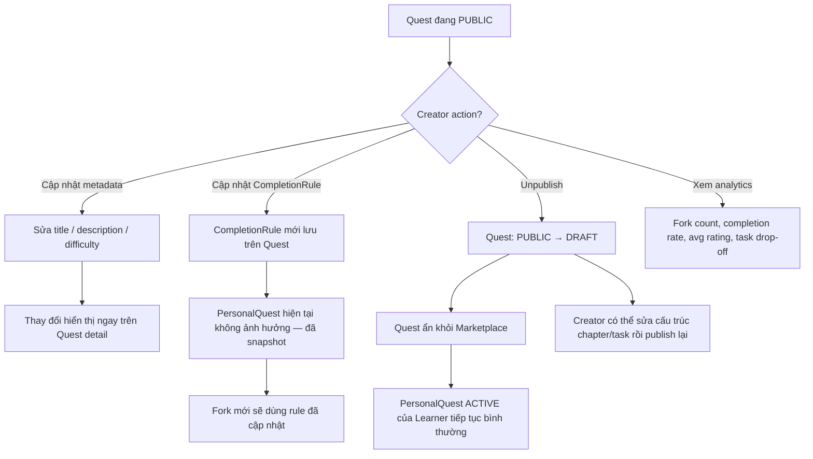

- Chỉ cấu trúc chapter/task/resource là locked sau publish (`ensureDraft()` guard); metadata và CompletionRule không bị lock
- Unpublish → DRAFT mở lại khả năng sửa cấu trúc; Learner đang học không bị ảnh hưởng
- HIDDEN là hành động của Admin, không phải Creator; Creator không thể tự set HIDDEN

---

### 2.3 Negative Flows

#### N1 — QUIZ Fail Liên Tiếp

**Khi nào**: Learner không vượt được passThreshold sau nhiều lần thử và quyết định bỏ qua task

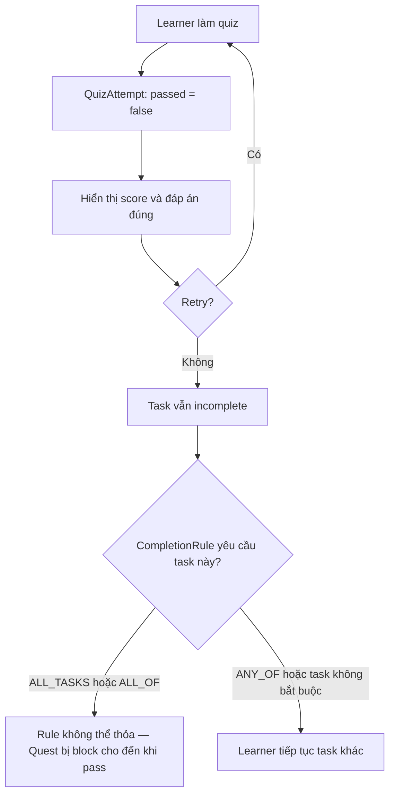

- Không có giới hạn retry cho QUIZ
- Nếu task QUIZ bắt buộc theo rule và không pass, Quest không thể COMPLETED cho đến khi Learner quay lại pass

---

#### N2 — SUBMISSION Graded FAIL / NEEDS_REVISION

**Khi nào**: AI Grader không chấp nhận submission của Learner

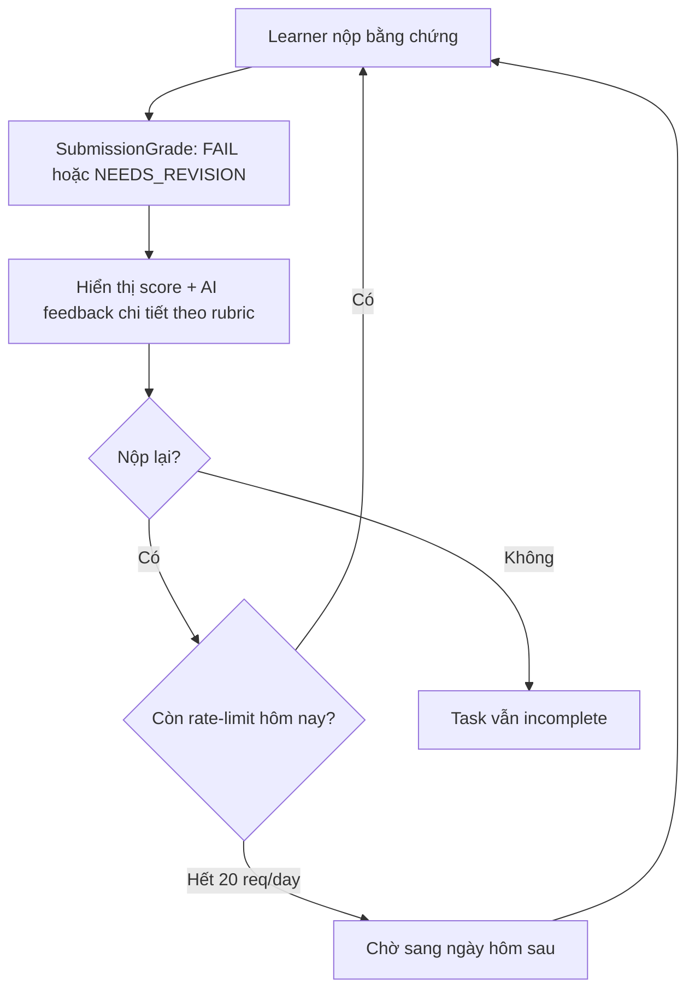

- FAIL và NEEDS_REVISION đều không tạo TaskCompletion; phân biệt nhau qua feedback tone, không qua logic xử lý
- Rate-limit 20 req/day tính toàn bộ SUBMISSION/PRACTICE của user, không per-task
- Learner có thể đọc lại tất cả SubmissionGrade cũ trước khi quyết định nộp lại

---

#### N3 — Learner Abandons Quest

**Khi nào**: Learner không còn muốn tiếp tục PersonalQuest

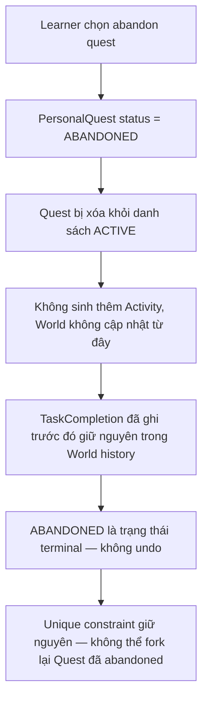

- TaskCompletion trước khi abandon không bị xóa: District.completionCount giữ nguyên những gì đã tích lũy
- Unique constraint `(user_id, quest_id)` chặn fork lại — đây là trade-off cần xem xét thêm trong thiết kế

---

#### N4 — Admin Ẩn Quest Vi Phạm

**Khi nào**: Quest vi phạm community guidelines, Admin cần can thiệp

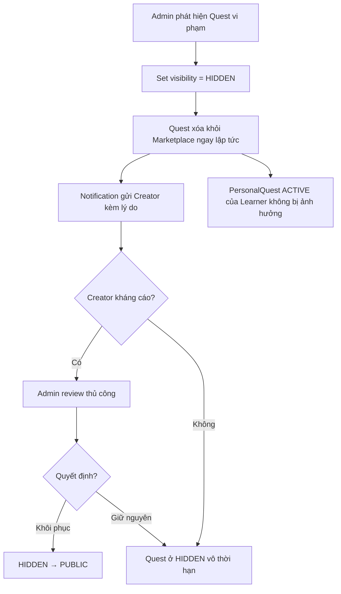

- HIDDEN là trạng thái Admin-only; Creator không thể tự set HIDDEN và không thể tự thoát HIDDEN
- Tách biệt với Creator unpublish (PUBLIC → DRAFT): hai action này độc lập nhau

---

#### N5 — Undo Task Làm Quest Reopen

**Khi nào**: Learner undo một TaskCompletion sau khi Quest đã COMPLETED

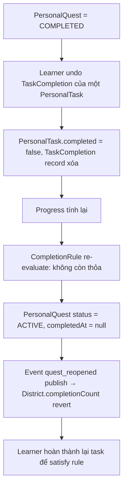

- `reopen()` method tồn tại trong PersonalQuest domain — reverse path này có chủ đích
- World cần xử lý event `quest_reopened` để revert District.completionCount (symmetric với `quest_completed`)

---

## 3. Module Grouping

### Module 1 — Identity · BC `identity`

> `com.questhub.modules.identity`

| Entity | Role |
|--------|------|
| **User** | Người dùng với role USER / CREATOR / ADMIN |

> Đăng ký, xác thực, quản lý profile, follower/following counter (Follow table thuộc Social service)

### Module 2 — Content · BC `quest`

> `com.questhub.modules.quest` — Creator-facing: content authoring và publish lifecycle

| Entity | Role |
|--------|------|
| **SkillDomain** | Lĩnh vực kỹ năng lớn (Programming, Language, Fitness...) |
| **LearningPath** | Lộ trình học gom nhóm nhiều Quest; cầu nối Quest ↔ SkillDomain |
| **Quest** | Template học tập; cấu trúc locked sau publish |
| **Chapter** | Nhóm Task trong Quest |
| **Task** | Đơn vị học nhỏ nhất, có type riêng |
| **Resource** | Tài liệu đính kèm Task LEARN |

> Quản lý skill domain, tạo learning path, soạn quest (chapter, task, resource), publish lifecycle (DRAFT → PUBLIC ↔ DRAFT; Admin có thể set HIDDEN)

### Module 3 — Learning Progress · BC `quest`

> `com.questhub.modules.quest` — Learner-facing: fork và theo dõi tiến độ cá nhân

| Entity | Role |
|--------|------|
| **PersonalQuest** | Bản fork của Quest thuộc về Learner; kế thừa learningPathId |
| **PersonalChapter** | Chapter tương ứng trong PersonalQuest |
| **PersonalTask** | Task tương ứng, ghi nhận trạng thái hoàn thành |
| **TaskCompletion** | Bản ghi hoàn thành task (source of truth) |
| **QuizAttempt** | Kết quả làm quiz |
| **SubmissionGrade** | Kết quả AI chấm bài |

> Fork quest, hoàn thành task theo từng loại, AI grading, evaluate CompletionRule, tính tiến độ, abandon quest

### Module 4 — Marketplace · BC `marketplace`

> `com.questhub.modules.marketplace`

| Entity | Role |
|--------|------|
| **Review** | Đánh giá sao + comment cho Quest |
| **Favorite** | Quest được Learner lưu lại |

> Khám phá quest, tìm kiếm, đánh giá, yêu thích, analytics cho Creator

### Module 5 — World · BC `world`

> `com.questhub.modules.world`

| Entity | Role |
|--------|------|
| **World** | Thế giới cá nhân của User |
| **District** | Khu vực trong World, đại diện SkillDomain |
| **Building** | Công trình visualize trong District |
| **Achievement** | Thành tựu intrinsic |
| **UserAchievement** | Thành tựu đã mở khóa |
| **LeaderboardStat** | Read model tổng hợp (questCount, taskCount per user); computed, không có bảng riêng |

> Visualize tiến bộ thật, unlock building theo completion count, mở khóa thành tựu tại các mốc thật, leaderboard so sánh progress giữa users

### Module 6 — Social · side service `social` *(Go)*

> Giao tiếp với monolith qua Outbox Event pattern

| Entity | Role |
|--------|------|
| **Follow** | Mối quan hệ theo dõi giữa User |
| **Activity** | Sự kiện do User tạo ra, nguồn của Feed |
| **Discussion** | Chủ đề thảo luận gắn với Quest |
| **Comment** | Bình luận trên Quest / Discussion |

> Activity feed từ người đang follow, thảo luận theo quest, bình luận lồng nhau

### Module 7 — AI · side service `ai-service` *(Python)*

> Read-only access vào monolith data qua internal API

| Entity | Role |
|--------|------|
| **CoachSession** | Phiên chat với AI Coach |
| **CoachMessage** | Tin nhắn trong phiên coach |

> Gợi ý quest theo mục tiêu, sinh quest mới bằng AI, chấm bài SUBMISSION/PRACTICE (AI Grader), AI Coach cá nhân (read-only progress via tool calling)

### Module 8 — Notification · side service `notification` *(Go)*

> Giao tiếp với monolith qua Outbox Event pattern

| Entity | Role |
|--------|------|
| **Notification** | Thông báo gửi đến User tại mỗi sự kiện lifecycle |

> Multi-channel notification (in-app / push / email) triggered by events: quest completed, achievement unlocked, task graded, social interactions

### Module 9 — Admin · BC `admin`

> `com.questhub.modules.admin`

| Entity | Role |
|--------|------|
| **FeatureFlag** | Cờ bật / tắt tính năng |

> Kiểm duyệt quest vi phạm (set HIDDEN), quản lý SkillDomain, bật / tắt feature flags

---

## 4. Epic & User Story

### Epic 1 — Identity

| # | User Story | Acceptance Criteria |
|---|-----------|---------------------|
| 1.1 | As a **Guest**, I want to create an account so I can start tracking my progress | Email / OAuth support; World auto-created after registration; profile default public |
| 1.2 | As a **User**, I want to update my profile (avatar, bio, social links) so others can know who I am | CRUD profile; toggle public/private; role promoted to CREATOR automatically when first quest is published |

### Epic 2 — Content

| # | User Story | Acceptance Criteria |
|---|-----------|---------------------|
| 2.1 | As a **Creator**, I want to create a learning path with title, description and difficulty so I can bundle multiple quests toward one goal | Path belongs to a SkillDomain (mandatory); default private on creation; Creator is owner |
| 2.2 | As a **Creator**, I want to create a quest with chapters and tasks so I can structure a roadmap for others to follow | Quest can optionally link to a LearningPath; quests without a LearningPath have no SkillDomain and are only discoverable via search; min 1 chapter, min 1 task; default DRAFT |
| 2.3 | As a **Creator**, I want to add chapters and tasks, and attach resources to LEARN tasks so the learning path is clear and logical | Chapter: title, description, reorderable; task: title, type, order; LEARN tasks support VIDEO, ARTICLE, BOOK, DOCUMENT, COURSE, PODCAST, FILE, LINK; can delete chapter/task if quest not yet forked |
| 2.4 | As a **Creator**, I want to set a completion rule for my quest so it is marked done only when the real criteria are met | Default ALL_TASKS; supports QUIZ_SCORE (≥ threshold %), SUBMISSION (must submit), ALL_OF (AND), ANY_OF (OR); CompletionRule snapshotted into PersonalQuest at fork — updating rule after publish only affects new forks, not existing ones |
| 2.5 | As a **Creator**, I want to publish my quest so others can discover it | Quest transitions DRAFT → PUBLIC; appears in Marketplace; Creator can unpublish back to DRAFT anytime; Admin can independently set HIDDEN |

### Epic 3 — Learning Progress

| # | User Story | Acceptance Criteria |
|---|-----------|---------------------|
| 3.1 | As a **Learner**, I want to fork a public quest into my own copy so I can track personal progress without affecting the original | Creates PersonalQuest + PersonalChapters + PersonalTasks; Learner is owner; CompletionRule and learningPathId snapshotted; original quest unaffected; one fork per user per quest |
| 3.2 | As a **Learner**, I want to complete tasks of different types so my progress reflects real work done | LEARN/REFLECTION: tick complete (REFLECTION requires text if minLength set); QUIZ: pass threshold; SUBMISSION/PRACTICE: submit evidence; TaskCompletion created; completion can be undone |
| 3.3 | As a **Learner**, I want to take a quiz and see my score immediately so I know if I've passed | Each attempt creates QuizAttempt (score, max_score, passed); pass → task auto-completes; fail → retry allowed; attempt history viewable |
| 3.4 | As a **Learner**, I want my quest marked completed automatically when the rule is satisfied so I know I have achieved my goal | CompletionRule evaluated on each task completion/undo; satisfied → status = COMPLETED, completed_at saved; Activity + Notification created; Achievement criteria checked |
| 3.5 | As a **Learner**, I want to customize my forked quest so I can adapt the path to my needs | Add/edit/delete chapters and tasks on own PersonalQuest only; no effect on original Quest or other Learners' forks |
| 3.6 | As a **Learner**, I want to abandon a quest I no longer intend to finish so my active list stays clean | PersonalQuest status = ABANDONED; does not affect World or achievements; cannot be undone from this flow |

### Epic 4 — Marketplace

| # | User Story | Acceptance Criteria |
|---|-----------|---------------------|
| 4.1 | As a **Guest**, I want to browse learning paths and quests so I can find interesting goals to pursue | Display by SkillDomain (via LearningPath); popular quests (fork count + rating); trending quests (recent usage); no login required |
| 4.2 | As a **Guest**, I want to search quests by keyword so I can find quests relevant to my goal | Search title, description, chapter title, task title; relevance-ranked results; filter by domain (only for quests with LearningPath) and difficulty |
| 4.3 | As a **Learner**, I want to rate a quest I have forked so I can help others choose quality content | 1–5 stars + optional text; only reviewable after fork; one review per quest (updatable); avg_rating shown on quest card |
| 4.4 | As a **Learner**, I want to save a quest to favorites so I can find it easily later | Toggle add/remove; favorites list in profile; no fork required to favorite |
| 4.5 | As a **Creator**, I want to see how people are using and completing my quest so I can understand its impact | Show fork count, completion rate, avg rating; show task/chapter drop-off metrics |

### Epic 5 — World

| # | User Story | Acceptance Criteria |
|---|-----------|---------------------|
| 5.1 | As a **Learner**, I want to see my Knowledge World so I can visualize progress across different domains | One District per SkillDomain; District reflects TaskCompletion count from quests in that domain (via LearningPath); World updates immediately on new completion |
| 5.2 | As a **Learner**, I want to see district details with buildings so I can feel my progress visually | District shows completed quests, active quests, total tasks completed; Buildings unlock by completion_count — decorative only, no logic impact |
| 5.3 | As a **Visitor**, I want to view another user's Knowledge World so I can be inspired by their progress | Only visible if user's profile is public; read-only; no edit access |
| 5.4 | As a **Learner**, I want to unlock achievements at real milestones so I get intrinsic recognition | Criteria: first quest, 5 quests, 10 tasks, 20 tasks, 5 tasks in same domain, 10 tasks in same domain; no XP/Level system; shown on feed and profile |
| 5.5 | As a **User**, I want to see a leaderboard of quest and task completion counts so I can compare progress with others | Shows questCount + taskCount per user; computed from PersonalQuest + TaskCompletion; only shows users with public profiles |

### Epic 6 — Social

| # | User Story | Acceptance Criteria |
|---|-----------|---------------------|
| 6.1 | As a **Learner**, I want to follow other users so I can see their progress and be motivated | Toggle follow/unfollow; follower/following count shown on profile |
| 6.2 | As a **Learner**, I want to see a feed of activities from people I follow so I can stay updated | Events: quest completed, quest forked, task completed, quest published, achievement unlocked; sorted by most recent |
| 6.3 | As a **Learner**, I want to comment on quests and in discussions so the community can help each other | Comment on Quest (target_type = QUEST); create Discussion per Quest; nested replies max 2 levels via parent_id |

### Epic 7 — AI

| # | User Story | Acceptance Criteria |
|---|-----------|---------------------|
| 7.1 | As a **Learner**, I want to describe my goal and get quest recommendations so I can quickly find a relevant path | Text input; returns list of matching quests; suggests AI generation if no match found |
| 7.2 | As a **Learner**, I want AI to generate a quest for a goal with no existing quest so I can start immediately | AI generates quest with chapters + tasks of appropriate types; created as DRAFT under User name; User can edit before using; rate-limited |
| 7.3 | As a **Learner**, I want AI to grade my SUBMISSION/PRACTICE submission against the task rubric so I know if my work meets requirements | Applies only to tasks with rubric in task.config; grades: PASS/FAIL/NEEDS_REVISION + score (0–100) + feedback; PASS auto-creates TaskCompletion and evaluates CompletionRule; rate-limited: 20 req/day per user |
| 7.4 | As a **Learner**, I want to chat with an AI coach that knows my real progress so I can stay on track | AI reads live data via tool calling: get_progress, get_streak, get_achievements, get_upcoming_tasks; streaming response; session history preserved; AI is read-only — cannot modify or grade quest on behalf of user |

### Epic 8 — Notification

| # | User Story | Acceptance Criteria |
|---|-----------|---------------------|
| 8.1 | As the **system**, I want to notify User on key learning events so they stay engaged | Notify: quest forked, task graded (PASS/FAIL), quest completed |
| 8.2 | As the **system**, I want to notify User when an Achievement is unlocked so they feel recognized | In-app notification + optional push/email |
| 8.3 | As a **User**, I want to manage notification preferences so I receive only relevant alerts | Toggle per channel (in-app / push / email) and per notification type |

### Epic 9 — Admin

| # | User Story | Acceptance Criteria |
|---|-----------|---------------------|
| 9.1 | As an **Admin**, I want to hide a quest that violates community guidelines so the marketplace stays safe | Quest visibility set to HIDDEN (separate from Creator's DRAFT/PUBLIC toggle); not visible in Marketplace; Creator receives Notification with reason |
| 9.2 | As an **Admin**, I want to create and manage skill domains so quests and paths are organized properly | CRUD skill domains (name, slug, icon, isActive); deactivating a domain does not delete existing LearningPaths but hides from browse; changes affect District in World |
| 9.3 | As an **Admin**, I want to enable or disable specific features so I can control rollout of new functionality | CRUD feature flags via admin panel; change takes effect immediately without redeployment |

> **Total:** 9 Epics · 35 User Stories

---

## 5. Module Logical Diagram

### 5.1 Module Dependency Graph

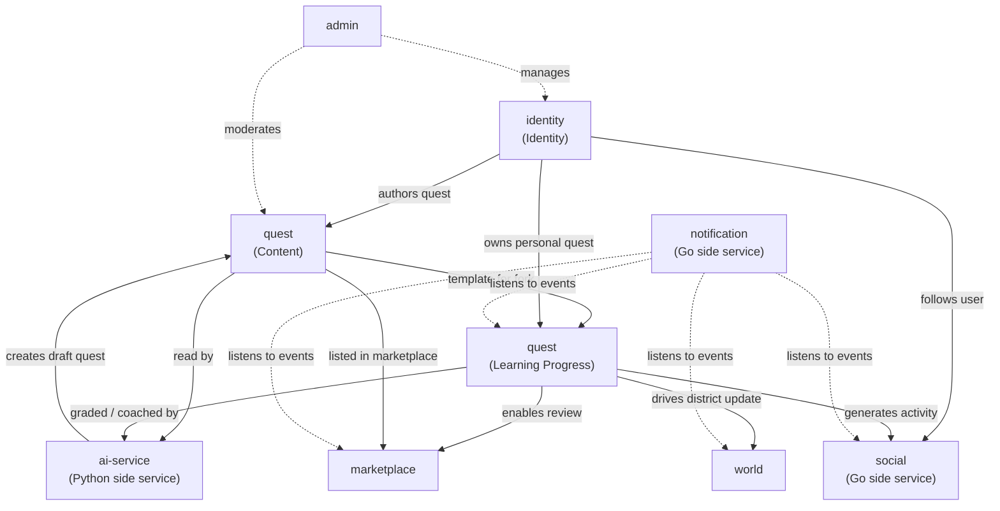

### 5.2 Inter-Module Relationships

| From (BC) | To (BC) | Relationship | Description |
|-----------|---------|-------------|-------------|
| `identity` | `quest` · Content | authors quest | User với role CREATOR tạo Quest, LearningPath |
| `quest` · Content | `quest` · Progress | template for fork | Learner fork Quest → PersonalQuest copy toàn bộ Chapter / Task / CompletionRule / learningPathId |
| `identity` | `quest` · Progress | owns personal quest | PersonalQuest thuộc về User; unique constraint 1 fork per user per quest |
| `quest` · Progress | `world` | drives district update | TaskCompletion → tăng District.completionCount → potentially unlock Building; chỉ từ quests có LearningPath |
| `quest` · Progress | `marketplace` | enables review | Learner chỉ review được Quest đã fork |
| `quest` · Content | `marketplace` | listed in marketplace | Quest PUBLIC xuất hiện trong Marketplace; browse by domain chỉ với Quest có LearningPath |
| `identity` | `social` | follows user | User follow / unfollow; counter denormalized trên User, Follow table ở social service |
| `quest` · Progress | `social` | generates activity | quest.completed / quest.forked event → Activity → Feed của followers |
| `quest` · Content | `ai-service` | read by | AI đọc Quest / Task config để generate quest hoặc grade submission |
| `quest` · Progress | `ai-service` | graded / coached by | SubmissionGrade: AI chấm PersonalTask; CoachSession: AI đọc live progress qua tool calling |
| `ai-service` | `quest` · Content | creates draft quest | AI sinh Quest mới (DRAFT) dưới tên User, chờ User edit và publish |
| `notification` | all BCs | listens to events | Gửi multi-channel notification tại mỗi sự kiện: completion, achievement, grade, social |
| `admin` | `quest` · Content | moderates | Admin set Quest HIDDEN (độc lập với Creator unpublish về DRAFT), CRUD SkillDomain |
| `admin` | `identity` | manages | Admin quản lý User role, status |

### 5.3 Architecture Notes

- **Content + Learning Progress** là hai module conceptual trong **cùng một Bounded Context `quest`** (`com.questhub.modules.quest`); tách đôi trong tài liệu này để phân biệt rõ aggregate cluster theo persona (Creator-facing vs Learner-facing), không phải ranh giới service hay package
- **Quest structure (chapter/task) bất biến sau publish** — `ensureDraft()` guard; nhưng metadata (title, description, difficulty) và CompletionRule có thể cập nhật bất cứ lúc nào; thay đổi CompletionRule sau publish chỉ ảnh hưởng fork mới, không ảnh hưởng PersonalQuest hiện tại đã snapshot
- **Quest standalone (không có LearningPath) không có SkillDomain** — chỉ tìm được qua keyword search; District trong World chỉ được cập nhật từ quest có domain (qua LearningPath chain)
- **CompletionRule snapshot** vào PersonalQuest tại thời điểm fork; PersonalQuest hoàn toàn độc lập với Quest gốc sau fork
- **PersonalQuestStatus có 3 trạng thái**: ACTIVE → COMPLETED (hoàn thành đủ rule), ACTIVE → ABANDONED (Learner tự abandon); ABANDONED là trạng thái terminal
- **Follow counter denormalized** trên User (followerCount/followingCount); bảng Follow thật nằm ở Social side service (Go); hai bên sync qua event
- **Social (Go), Notification (Go), AI (Python)** là side services chạy độc lập; giao tiếp với Java monolith qua Outbox Event pattern (bảng outbox_events)
- **AI Coach là read-only** — đọc progress thật qua tool calling nhưng không ghi / chấm / sửa quest thay user
- **World là read-only projection** từ TaskCompletion — không có business logic độc lập; Building thuần visualize, không ảnh hưởng logic nghiệp vụ
- **No XP / Level / game loop giả tạo** — Achievement gắn mốc thật, Reward intrinsic, không có virtual currency hay leaderboard
