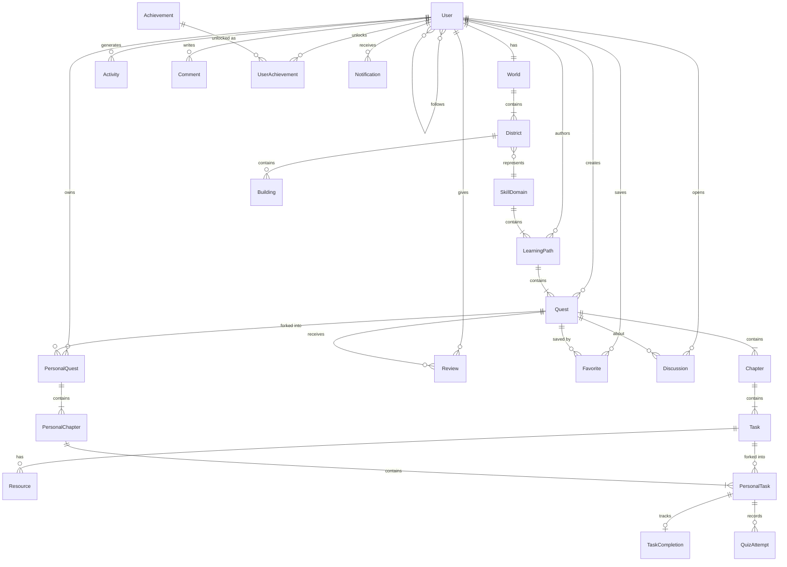

# QuestHub — Conceptual Domain Model (v2)

> QuestHub là **goal-achievement platform** — người dùng chọn một mục tiêu (goal), đi theo lộ trình (LearningPath) gồm nhiều Quest, mỗi Quest chia thành Chapter, mỗi Chapter gồm các Task thực tế. Tiến bộ thật được phản ánh vào World cá nhân.

## Hierarchy — Core Domain

```
Domain
 └── Learning Path
      └── Quest
           └── Chapter
                └── Task
                     └── Resource (chỉ cho Task loại LEARN)
```

```
Programming        Language          Fitness          Music
 └── Java Backend   └── Japanese N5    └── 30-Day Fat   └── Piano
     Engineer            │                Loss             Beginner
     ├── Java Core       ├── Hiragana     ├── Workout A     ├── Notes
     ├── Spring Boot     ├── Kanji        ├── Diet Plan     ├── Scales
     ├── Database        └── Grammar      └── Cardio        └── Songs
     └── Docker / AWS
```

## Diagram



## Ký hiệu

| Ký hiệu | Nghĩa |
|---------|-------|
| `\|\|` | đúng 1 |
| `o{` | 0 hoặc nhiều |
| `\|{` | 1 hoặc nhiều |
| `}o` | 0 hoặc nhiều (chiều ngược) |

## Ubiquitous Language

| Thuật ngữ | Định nghĩa |
|-----------|-----------|
| **Domain** | Lĩnh vực kỹ năng lớn (Programming, Language, Fitness...) — đỉnh của hierarchy |
| **LearningPath** | Lộ trình hoàn chỉnh để đạt một mục tiêu (vd: Java Backend Engineer), gồm nhiều Quest |
| **Quest** | Đơn vị tiến bộ chính, template bất biến do creator tạo (vd: Spring Security Fundamentals) |
| **Chapter** | Nhóm task trong Quest, chia quest lớn thành phần nhỏ (Authentication, Authorization, JWT) |
| **Task** | Đơn vị nhỏ nhất user thực hiện, có `type` riêng (LEARN/QUIZ/PRACTICE/SUBMISSION/REFLECTION) |
| **Resource** | Tài liệu đính kèm Task LEARN (video, article, book, course...) |
| **TaskType** | Enum chuẩn hóa loại task: LEARN, QUIZ, PRACTICE, SUBMISSION, REFLECTION |
| **CompletionRule** | Luật hoàn thành Quest có thể cấu hình (all tasks / quiz ≥ 80% / có submission...) |
| **Reward** | Phần thưởng **intrinsic** khi hoàn thành Quest — không phải XP/Level/điểm số |
| **PersonalQuest** | Bản fork của Quest về tay user, độc lập hoàn toàn với bản gốc |
| **PersonalChapter** | Chapter tương ứng trong PersonalQuest |
| **PersonalTask** | Task tương ứng trong PersonalChapter — nơi ghi nhận trạng thái hoàn thành |
| **TaskCompletion** | Bản ghi khi user hoàn thành một PersonalTask (source of truth cho World) |
| **QuizAttempt** | Kết quả một lần làm quiz của Task loại QUIZ |
| **Review** | Đánh giá 1–5 sao + nội dung text của user cho Quest đã fork |
| **Favorite** | Quest được user lưu lại, không cần fork |
| **Comment** | Bình luận của user trên Quest hoặc Discussion |
| **Discussion** | Chủ đề thảo luận gắn với Quest (hỏi đáp, chia sẻ) |
| **World** | Thế giới cá nhân của user, reflect tiến bộ thật |
| **District** | Khu vực trong World, đại diện cho một Domain (SkillDomain) |
| **Building** | Công trình visualize trong District — **thuần trang trí**, loại building tùy ý |
| **Achievement** | Thành tựu intrinsic gắn mốc thật (quest đầu tiên, X tasks...) — không gắn XP |
| **Activity** | Sự kiện do user tạo ra, dùng cho Feed |
| **Notification** | Thông báo trong app (đồng bộ) + push/email (bất đồng bộ) |
| **SubmissionGrade** | Kết quả AI chấm bài task SUBMISSION/PRACTICE — `status` PASS/FAIL/NEEDS_REVISION + score + feedback, snapshot rubric lúc chấm |
| **CoachSession / CoachMessage** | Phiên trò chuyện giữa user và AI Coach. AI đọc progress thật qua tool calling nhưng **không ghi/sửa** quest của user |

## Ghi chú thiết kế

- **Hierarchy 4 tầng**: Domain → LearningPath → Quest → Chapter → Task. Task là đơn vị nhỏ nhất; Resource chỉ gắn với Task loại LEARN.
- **CompletionRule là cấu hình được** — không còn cứng nhắc "hoàn thành 100% objective". Quest có thể yêu cầu *quiz ≥ 80% AND có submission*.
- **Không XP, không Level, không game loop giả tạo** — Reward intrinsic, Achievement gắn mốc thật.
- **Building chỉ để visualize** — District reflect tiến bộ thật từ `TaskCompletion`, Building là lớp trang trí, không ảnh hưởng logic.
- **Quest là template bất biến** — khi user fork, bản gốc không bị ảnh hưởng. PersonalQuest/PChapter/Ptask là bản copy độc lập.
- **Purchase/Subscription không phải commerce** — chỉ là mô hình visibility public/private (DRAFT/PUBLIC/HIDDEN).
- **AI làm 4 việc**: gợi ý quest, sinh quest mới, chấm bài SUBMISSION/PRACTICE (AI Grader), và coach cá nhân (AI Coach — **chỉ đọc** progress, không tự ý sửa quest).
