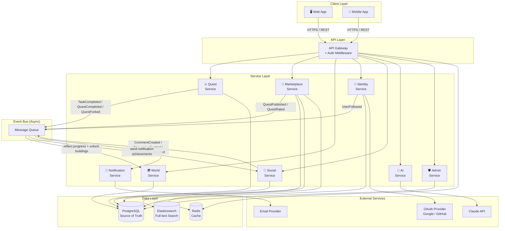

# QuestHub — High Level Design (v2)

## Architecture Diagram



---

## Giải thích từng tầng

### Client Layer
| Component | Mô tả |
|-----------|-------|
| Web App | Next.js — SSR cho SEO (Marketplace, Quest detail, Learning Path detail) |
| Mobile App | React Native — tracking daily progress |

---

### API Layer
| Component | Mô tả |
|-----------|-------|
| API Gateway | Single entry point, routing tới các service |
| Auth Middleware | Verify JWT token trước khi forward request |

---

### Service Layer

| Service | Module | Trách nhiệm |
|---------|--------|-------------|
| Quest Service | MOD-01 | CRUD LearningPath, Quest, Chapter, Task, Resource + fork + completion rule evaluation |
| Marketplace Service | MOD-02 | Discovery, Search, Review, Favorite, Ranking |
| World Service | MOD-03 | World, District, Building, Achievement |
| Identity Service | MOD-04 | Auth, Profile, Role, Follow |
| Social Service | MOD-05 | Feed, Activity, Comment, Discussion |
| AI Service | MOD-06 | Quest recommendation, Quest generation, submission grading (AI Grader), AI Coach (read-only agent) |
| Admin Service | MOD-07 | Moderation, Domain, Feature Flag |
| Notification Service | — | In-app notification, push, email |

---

### Event Bus

Các event quan trọng chạy **async** qua Message Queue:

| Event | Publisher | Consumer | Mục đích |
|-------|-----------|----------|---------|
| `TaskCompleted` | Quest Service | World Service | Cập nhật District + mở khóa Building |
| `TaskCompleted` | Quest Service | Social Service | Thêm vào Feed |
| `TaskCompleted` | Quest Service | Notification Service | Thông báo user |
| `QuestCompleted` | Quest Service | World Service | Kiểm tra Achievement + cập nhật path progress |
| `QuestCompleted` | Quest Service | Social Service | Activity QUEST_COMPLETED |
| `AchievementUnlocked` | Social Service | Notification Service | Thông báo achievement mới |
| `QuestForked` | Quest Service | Marketplace Service | Tăng fork count |
| `QuestPublished` | Marketplace Service | Elasticsearch | Index quest để search |
| `QuestRated` | Marketplace Service | Quest Service | Recalculate avg_rating |
| `SubmissionGraded` | AI Service | Quest Service | PASS → tạo TaskCompletion + evaluate completion_rule |
| `SubmissionGraded` | AI Service | Notification Service | Thông báo kết quả chấm bài |
| `UserFollowed` | Identity Service | Social Service | Cập nhật Feed subscription |
| `CommentCreated` | Social Service | Notification Service | Thông báo chủ bài/chủ quest |
| `DiscussionCreated` | Social Service | Notification Service | Thông báo follower |

---

### Data Layer

| Store | Dùng cho |
|-------|---------|
| PostgreSQL | Source of truth — tất cả dữ liệu nghiệp vụ |
| Redis | Cache trending/popular quests, session, refresh tokens, feature flags |
| Elasticsearch | Full-text search quest theo keyword |

---

### External Services

| Service | Dùng cho |
|---------|---------|
| OAuth (Google/GitHub) | Đăng nhập không cần password |
| Claude API | Quest recommendation + Quest generation + submission grading + AI Coach chat/tools |
| Email Provider | Notification qua email |

---

## Data Flow — Luồng chính

### Luồng 1: User hoàn thành Task
```
Learner tick Task (hoặc nộp submission / làm quiz đạt)
  → Quest Service: tạo TaskCompletion + set is_completed
  → Quest Service: recalc progress + evaluate completion_rule
  → nếu rule thỏa: set status=COMPLETED, publish TaskCompleted + QuestCompleted
  → publish TaskCompleted event
    → World Service: cập nhật District completion_count, mở khóa Building
    → Social Service: tạo Activity trong Feed
    → Notification Service: gửi thông báo
  → QuestCompleted event
    → World Service: kiểm tra & unlock Achievement
```

### Luồng 2: User tìm kiếm Quest
```
User nhập keyword
  → API Gateway → Marketplace Service
  → Elasticsearch: full-text search
  → Redis: check cache trending
  → trả kết quả đã rank
```

### Luồng 3: Creator publish Quest
```
Creator click Publish
  → Marketplace Service: đổi visibility → PUBLIC
  → publish QuestPublished event
    → Elasticsearch: index quest mới
```

### Luồng 4: User fork Quest
```
Learner click "Use Quest"
  → Quest Service: tạo PersonalQuest + copy chapters/tasks + snapshot completion_rule
  → publish QuestForked event
    → Marketplace Service: tăng fork count
```

### Luồng 5: User mở discussion / comment
```
Learner tạo Discussion trên Quest
  → Social Service: INSERT discussions
  → publish DiscussionCreated event
    → Notification Service: thông báo creator + follower
```

### Luồng 6: AI chấm bài submission (AI Grader)
```
Learner nộp bài task SUBMISSION/PRACTICE → click "Chấm bằng AI"
  → API Gateway → AI Service (POST /api/ai/grade)
  → AI Service: lấy rubric từ task.config (internal Quest API)
  → Claude API: chấm theo rubric → JSON { status, score, feedback }
  → pydantic validate → INSERT submission_grades
  → nếu PASS: publish SubmissionGraded event
    → Quest Service: tạo TaskCompletion + evaluate completion_rule
    → Notification Service: thông báo kết quả
  → trả kết quả cho UI (feedback hiển thị kèm từng lần nộp)
```

### Luồng 7: AI Coach chat (tool calling)
```
Learner mở AI Coach, gửi tin nhắn
  → AI Service (POST /api/ai/coach/sessions/:id/messages)
  → Claude API: quyết định gọi tool (get_progress / get_streak / get_achievements / get_upcoming_tasks)
  → AI Service dispatch tool → query internal Quest/World API (READ only)
  → trả kết quả tool về Claude → streaming reply qua SSE
  → INSERT coach_messages (USER + ASSISTANT + TOOL rows) cho lịch sử chat
```

---

## Architectural Decisions

| Quyết định | Lý do |
|-----------|-------|
| **Event-driven** cho World update | World là derived data từ completion — không cần sync call |
| **CompletionRule cấu hình được** | Quest hoàn thành theo tiêu chí thật (quiz ≥ 80% + submission), không cứng nhắc |
| **Elasticsearch** riêng cho search | PostgreSQL full-text search không đủ mạnh cho ranking phức tạp |
| **Redis cache** cho Marketplace | Trending/Popular đọc nhiều, tính toán nặng — cache hợp lý |
| **Single PostgreSQL** | Project vừa — không cần tách DB theo service |
| **Message Queue** thay vì direct call | Decouple services — World Service không cần biết Quest Service |
| **Building thuần visualize** | Không ảnh hưởng logic — tránh game loop giả tạo |
| **Không XP/Level** | Reward intrinsic — Achievement gắn mốc thật |
