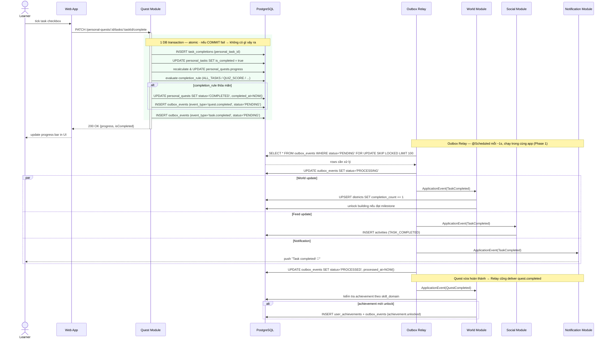
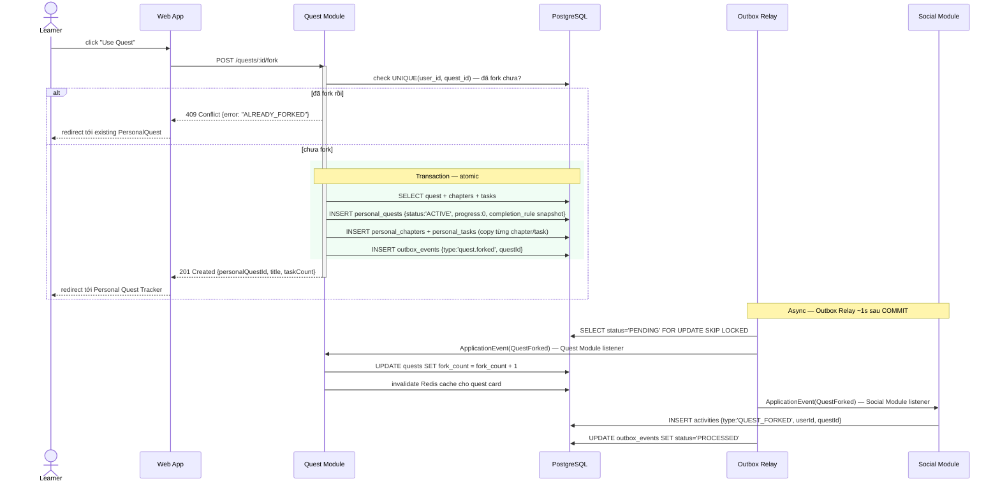
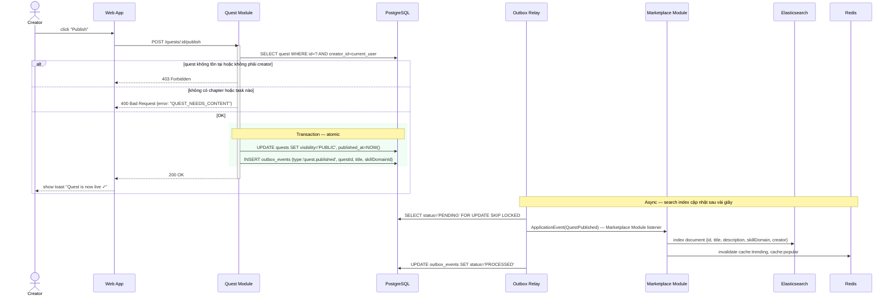
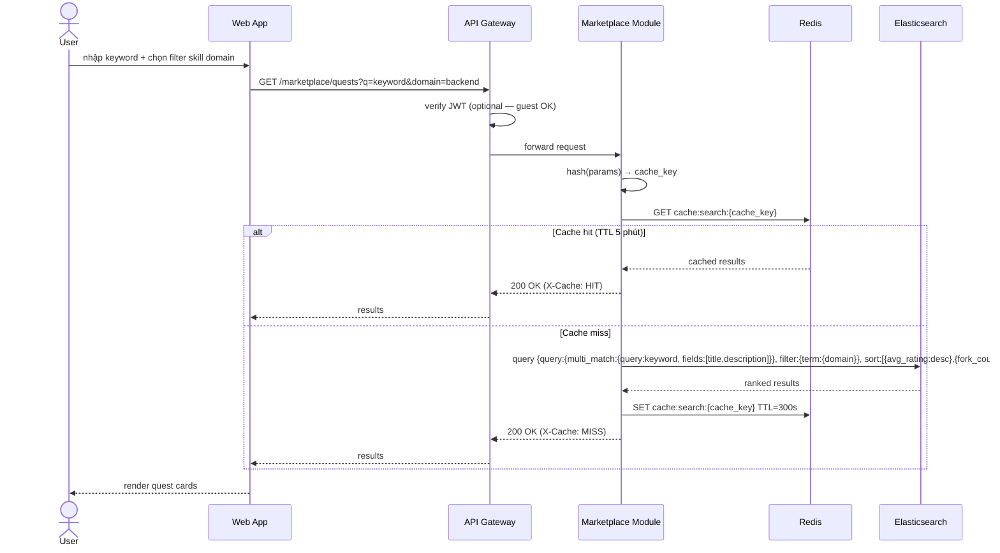
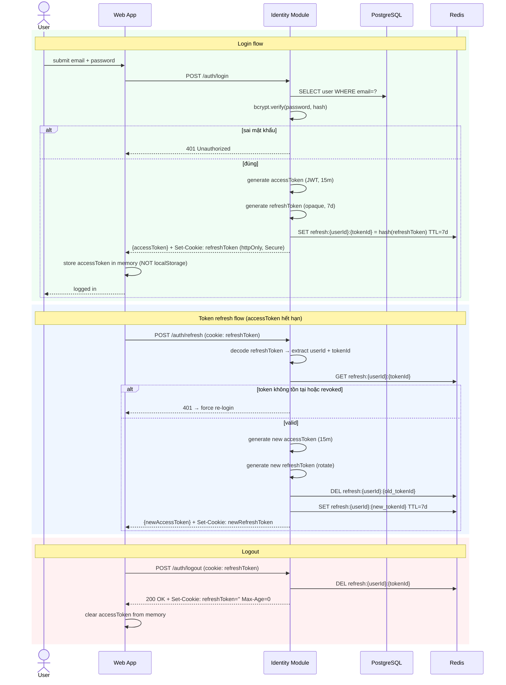
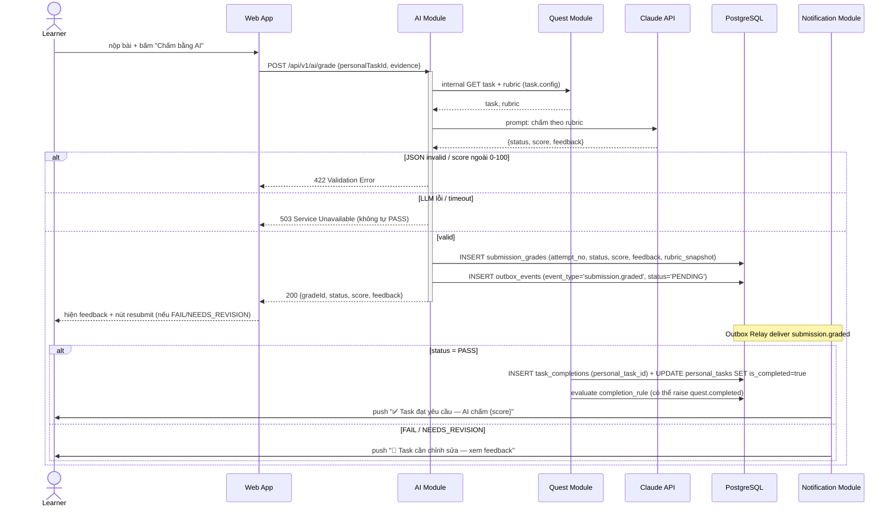
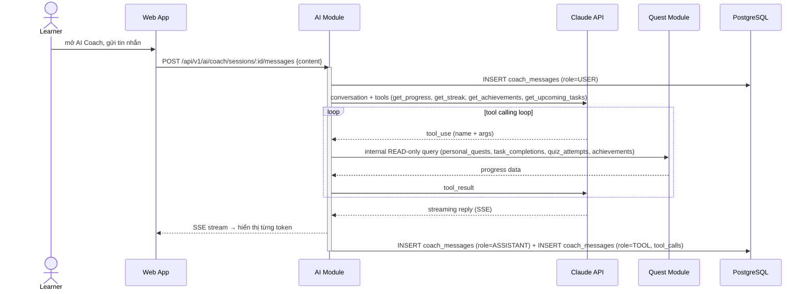

# QuestHub — Sequence Diagrams

7 key flows — request/response + async event chains

**Contents:**
1. [Complete Task](#flow-1-complete-task)
2. [Fork Quest](#flow-2-fork-quest)
3. [Publish Quest](#flow-3-publish-quest)
4. [Search Quest](#flow-4-search-quest)
5. [Auth & Token Refresh](#flow-5-auth--login--token-refresh)
6. [AI Grade Submission](#flow-6-ai-grade-submission-ai-grader)
7. [AI Coach Chat](#flow-7-ai-coach-chat-tool-calling)

---

## Flow 1: Complete Task

Outbox Pattern — DB write + outbox INSERT trong 1 transaction, Relay deliver async

**Notes:**
- **Atomic:** DB write + outbox INSERT trong 1 transaction. Nếu crash sau COMMIT, Relay retry. Không bao giờ mất event.
- **CompletionRule:** Cấu hình được — ALL_TASKS, QUIZ_SCORE, SUBMISSION, ALL_OF, ANY_OF. Task QUIZ hoàn thành qua `POST .../quiz-attempts` (score ≥ passThreshold), không qua PATCH complete.
- **SKIP LOCKED:** Nhiều Relay instance chạy song song vẫn an toàn — mỗi instance lock row riêng.
- **At-least-once:** Relay có thể deliver 2 lần nếu crash giữa chừng. Consumers phải idempotent — check eventId trước khi xử lý.
- **Phase 2:** Khi tách microservices, Relay thay `ApplicationEvent` bằng `RabbitTemplate.send()` — transaction logic không thay đổi.

---

## Flow 2: Fork Quest

Copy-on-fork pattern — tạo PersonalQuest độc lập, cập nhật fork_count và activity async via Outbox

**Notes:**
- **Copy-on-fork:** Chapters + tasks được copy sang personal_chapters/personal_tasks kèm snapshot completion_rule. Quest gốc thay đổi sau đó không ảnh hưởng Learner.
- **Ownership:** Quest Module owns quests → update fork_count. Social Module owns activities → insert feed entry. Không module nào cross-write.
- **Outbox đảm bảo:** INSERT outbox_events trong cùng transaction với INSERT personal_quests. Relay giao event at-least-once — consumers phải idempotent (check eventId).

---

## Flow 3: Publish Quest

Visibility change bởi Quest Module + Elasticsearch indexing async via Outbox

**Notes:**
- **Ownership:** Quest Module owns quests → chỉ Quest Module được UPDATE visibility. Marketplace Module lắng nghe event để index Elasticsearch.
- **Search lag:** ES index cập nhật async (~1-3s). Quest chưa xuất hiện ngay trong search sau publish.
- **Unpublish:** Reverse flow — Quest Module set visibility=DRAFT, INSERT outbox_events(quest.unpublished), Marketplace Module xóa ES doc + invalidate cache.

---

## Flow 4: Search Quest

Cache-first strategy — Redis → Elasticsearch fallback

**Notes:**
- **Cache key:** Hash của (q, domain, sort, page, limit). Khác params = khác cache entry.
- **Cache invalidation:** Khi quest mới publish hoặc rating thay đổi, cache liên quan bị xóa.
- **Guest support:** Search không cần login. Gateway skip JWT check nếu không có Authorization header.

---

## Flow 5: Auth — Login & Token Refresh

JWT access token (15 phút) + httpOnly refresh token (7 ngày), rotation strategy

**Notes:**
- **Access token:** JWT, signed HS256, 15 phút. Stored in memory — không bị XSS steal từ localStorage.
- **Refresh token rotation:** Mỗi refresh sinh token mới, revoke token cũ. Phát hiện token reuse = force logout all sessions.
- **httpOnly cookie:** refreshToken không accessible từ JS. Bảo vệ khỏi XSS. SameSite=Strict chống CSRF.

---

## Flow 6: AI Grade Submission (AI Grader)

Chấm bài SUBMISSION/PRACTICE theo rubric — PASS tự hoàn thành task qua event

**Notes:**
- **AI không tự PASS:** AI chỉ publish kết quả; Quest Module quyết định tạo TaskCompletion. task_completions.personal_task_id UNIQUE chặn duplicate.
- **attempt_no:** mỗi lần nộp = 1 row grade. Resubmit tăng attempt_no, chỉ grade mới nhất có hiệu lực.
- **Rate limit:** 20 req/day per user — chống spam token.

---

## Flow 7: AI Coach Chat (tool calling)

Read-only agent — Claude gọi tool đọc progress thật, streaming reply qua SSE

**Notes:**
- **Read-only agent:** mọi tool chỉ query internal API — không có tool nào write quest. User không bao giờ bị AI tự ý đổi progress.
- **Streaming:** FastAPI StreamingResponse (SSE). Message ASSISTANT lưu sau khi stream xong để giữ lịch sử.
- **Rate limit:** 60 messages/day per user. Session tối đa 5/ngày.
